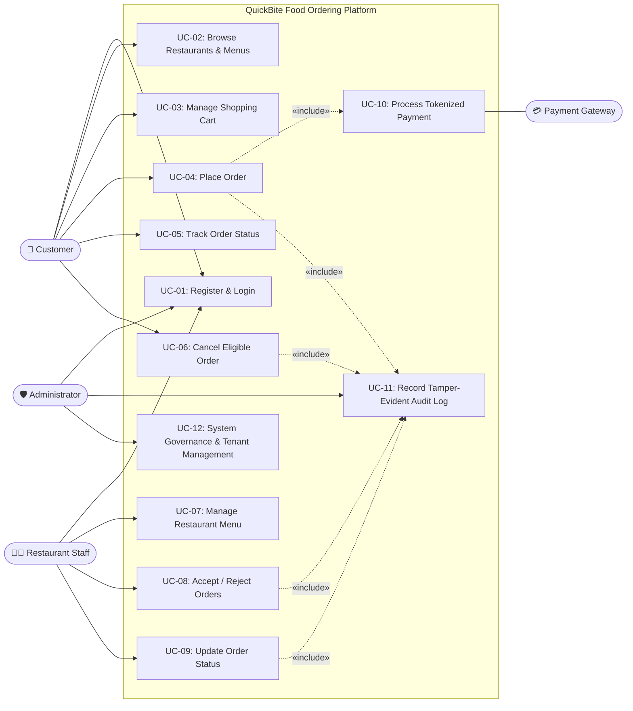

# Phase 3: Use Case Modeling & Specifications — QuickBite

## 1. Complete System Use Case Diagram

---

## 2. Critical Use Case Specification 1: Place Order (UC-04)

| Attribute | Specification Details |
|---|---|
| **Use Case ID** | **UC-04** |
| **Use Case Name** | **Place Order (Checkout with Authoritative Pricing)** |
| **Primary Actor** | Customer (Diner) |
| **Supporting Actor** | Payment Gateway Service, Audit Logging Service |
| **Preconditions** | 1. Customer is securely authenticated with valid, unexpired JWT. 2. Cart contains at least one food item from an active restaurant. 3. Restaurant is currently marked active and accepting orders. |
| **Trigger** | Customer clicks "Confirm & Pay" on the Checkout screen. |
| **Main Flow** | 1. Customer initiates order placement by submitting delivery address and simulated payment token (`tok_quickbite_...`). 2. System validates input formats (address length, token structure) via strict DTO validation. 3. System extracts `item_id` and `quantity` pairs from the cart. 4. System queries the database for authoritative unit prices and active item flags. 5. System computes subtotal, delivery fee, taxes, and final total amount. 6. System contacts Payment Gateway with token and computed total amount. 7. Payment Gateway verifies token, reserves funds, and returns `TRANSACTION_SUCCESS` with transaction reference. 8. System atomically writes new Order record (status: `PLACED`), creates Order Item records, and clears the customer's cart. 9. System appends event to immutable Audit Log (`ORDER_CREATED`). 10. System displays Order Confirmation to Customer with Order ID and estimated dispatch time. |
| **Alternative Flow** | **AF-1 (Partial Stock / Item Unavailable)**: At Step 4, if a selected item was disabled by kitchen staff, system halts transaction, notifies customer which item is unavailable, and requests cart review without charging the user. |
| **Exception Flow** | **EF-1 (Payment Gateway Declined)**: At Step 7, Payment Gateway returns `PAYMENT_FAILED`. System rolls back order creation, maintains cart contents, logs payment failure event (`PAYMENT_REJECTED`), and alerts user to retry with valid payment credentials. **EF-2 (Price Manipulation Attempt)**: If an attacker sends custom prices in the JSON payload, the system discards them and uses DB canonical prices. If negative quantity is submitted, Pydantic validation rejects with HTTP 422 Unprocessable Entity. |
| **Postconditions** | Order persisted with status `PLACED`, funds captured/reserved, customer cart reset, restaurant notification queued, audit log entry written. |
| **Security Controls** | - **Server-Side Authoritative Pricing**: Absolute prohibition of client-supplied totals. - **Zero Sensitive Card Data Storage**: Tokenized gateway integration only. - **Atomic Database Transactions**: All-or-nothing rollback on partial failure. - **Rate Limiting**: Prevent automated rapid checkout order spamming. |

---

## 3. Critical Use Case Specification 2: Restaurant Staff Updates Order Status (UC-09)

| Attribute | Specification Details |
|---|---|
| **Use Case ID** | **UC-09** |
| **Use Case Name** | **Restaurant Staff Updates Order Status** |
| **Primary Actor** | Restaurant Staff |
| **Supporting Actor** | Audit Logging Service |
| **Preconditions** | 1. Staff user is authenticated with a valid JWT bearing `role: restaurant_staff`. 2. Staff member is explicitly assigned to a specific `restaurant_id`. 3. The target order exists in the system. |
| **Trigger** | Staff member selects an order on the Kitchen Dashboard and chooses a new status transition. |
| **Main Flow** | 1. Staff requests an order transition (e.g., from `PLACED` to `ACCEPTED`, or `PREPARING` to `OUT_FOR_DELIVERY`). 2. System extracts `staff.restaurant_id` from the authenticated user token. 3. System fetches the order record from the database. 4. **Authorization Check**: System validates that `order.restaurant_id == staff.restaurant_id`. 5. **State Machine Validation**: System verifies that the requested transition is allowed according to the defined lifecycle:    $$\text{PLACED} \longrightarrow \{\text{ACCEPTED}, \text{REJECTED}\} \longrightarrow \text{PREPARING} \longrightarrow \text{OUT\_FOR\_DELIVERY} \longrightarrow \text{DELIVERED}$$ 6. System persists the new status and updates `updated_at` timestamp. 7. System records status change event in the immutable Audit Log (`ORDER_STATUS_CHANGED`). 8. System emits updated status, making it immediately visible to the Customer's tracking screen. 9. System returns HTTP 200 OK with the updated order summary. |
| **Alternative Flow** | **AF-1 (Order Rejection)**: At Step 1, staff selects `REJECTED` (e.g., kitchen at full capacity). System verifies state is `PLACED`, sets status to `REJECTED`, marks payment transaction for automatic refund, logs rejection reason, and notifies customer. |
| **Exception Flow** | **EF-1 (Cross-Tenant Authorization Violation - BOLA)**: At Step 4, staff attempts to modify an order belonging to a different restaurant (`order.restaurant_id != staff.restaurant_id`). System aborts update, raises HTTP 403 Forbidden, and records a security incident in Audit Log (`AUTHZ_FAILURE_TENANT_MISMATCH`). **EF-2 (Illegal State Machine Jump)**: Staff attempts to change a `DELIVERED` order back to `PREPARING` or cancel an already dispatched order. System rejects with HTTP 400 Bad Request: "Invalid order status transition". |
| **Postconditions** | Order status updated in database; customer tracking view refreshed; security audit record recorded. |
| **Security Controls** | - **Strict Tenant Isolation**: Role-Based & Attribute-Based Access Control (RBAC/ABAC). - **Deterministic Finite State Machine (FSM)**: Prevents illegal bypass of kitchen preparation phases. - **Tamper-Evident Audit Trail**: Captures staff ID, previous state, new state, and client IP. |
