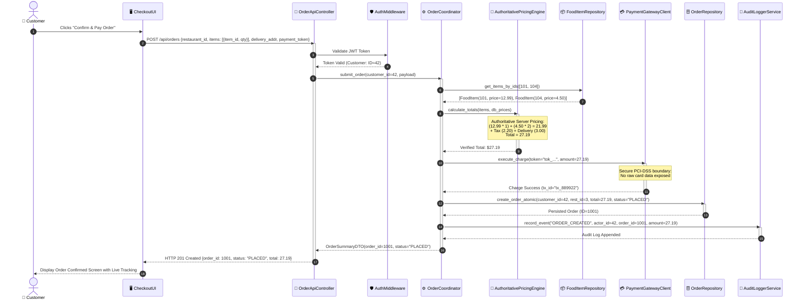

# Phase 3: Scenario-Based Analysis Model — "Place Order"

## 1. Overview of the Analysis Model
In robust software engineering (BCE — Boundary-Control-Entity modeling), the scenario-based analysis model bridges requirements to architectural design. This model defines the specific responsibilities and collaborations among:
- **Actors**: External initiators interacting with the system boundary.
- **Boundary Objects**: User interfaces, API controllers, and input validators that encapsulate interaction with external actors.
- **Control Objects**: Domain orchestrators, coordination managers, and business rule engines coordinating the execution flow.
- **Entity Objects**: Core business domain data models and persistence state.

---

## 2. Object Classification for "Place Order"

### 2.1 Actor
- **Customer (Diner)**: Authenticated user initiating checkout.

### 2.2 Boundary Objects
1. `CheckoutUI`: Web/Mobile client view presenting cart summary, address input, and payment authorization interface.
2. `OrderApiController`: FastAPI REST endpoint (`POST /api/orders`) handling HTTP request decoding, header token verification, and payload deserialization.
3. `PaymentGatewayClient`: Network boundary adapter communicating securely with the external tokenized payment processor.

### 2.3 Control Objects
1. `AuthenticationMiddleware`: Verifies cryptographic signature and expiry of the JWT bearer token, resolving the `current_user` principal.
2. `OrderCoordinator`: Central application service orchestrating cart verification, inventory check, transaction execution, and state persistence.
3. `AuthoritativePricingEngine`: Pure business rule engine that calculates subtotal, delivery charges, and taxes strictly from canonical database prices.
4. `AuditLoggerService`: Immutable security logging control that writes audit events into persistent storage.

### 2.4 Entity Objects
1. `Customer`: Entity representing the authenticated diner (`id`, `email`, `role`).
2. `Restaurant`: Entity representing the target culinary provider (`id`, `name`, `is_active`).
3. `FoodItem`: Entity representing individual menu items (`id`, `restaurant_id`, `name`, `price`, `is_available`).
4. `Cart` & `CartItem`: Temporary entities holding customer selections and requested quantities.
5. `Order`: Persistent transaction record (`id`, `customer_id`, `restaurant_id`, `total_amount`, `status`, `created_at`).
6. `OrderItem`: Persistent snapshot record (`order_id`, `food_item_id`, `unit_price`, `quantity`).
7. `Payment`: Record capturing transaction reference, token used, payment status, and amount charged.
8. `AuditLog`: Tamper-evident record of the order placement event.

---

## 3. Interaction Sequence Diagram (Mermaid)

---

## 4. Architectural Boundaries and Trust Zones Highlighted in Analysis

1. **Untrusted Boundary (Client-Side)**:
   - The browser / client interface runs in an untrusted execution environment. Any data submitted by the client (including attempted price overrides, custom discounts, or fake user identities) is treated as completely untrusted.
2. **Perimeter Security Boundary (API Controller & Middleware)**:
   - Enforces cryptographic token validation, schema validation (Pydantic), and rate-limiting before any execution enters the domain core.
3. **Internal Core Business Boundary (Coordinator & Pricing Engine)**:
   - Executes authoritative financial computations strictly from verified persistent storage, guaranteeing complete transactional and data integrity.
4. **Third-Party Payment Boundary**:
   - Isolates sensitive financial operations behind an abstract payment client, ensuring no cardholder data (PAN/CVV) ever enters QuickBite application storage.
