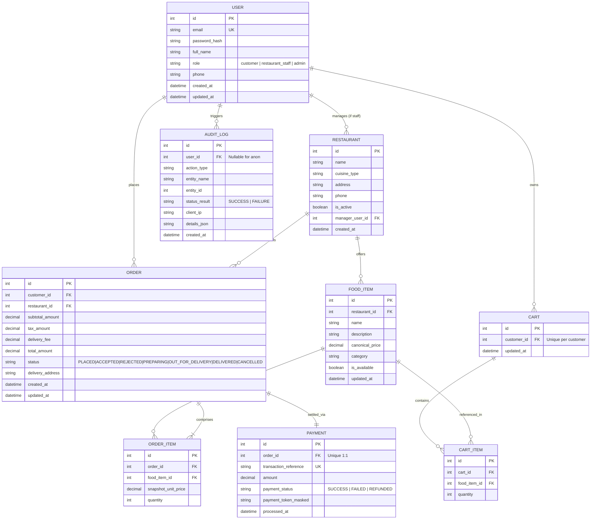
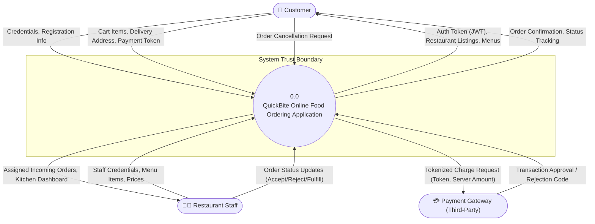

# Phase 4: Data Modeling (ER) & Data Flow Diagrams (DFD) — QuickBite

## 1. Entity-Relationship (ER) Model

The QuickBite persistent data model is normalized to Third Normal Form (3NF) to eliminate data redundancy and preserve referential and transactional integrity.

### 1.1 Complete ER Diagram (Mermaid)



### 1.2 Entity Dictionary & Integrity Constraints

| Entity | Primary Key | Foreign Keys | Key Security & Business Attributes | Cardinality & Rules |
|---|---|---|---|---|
| **USER** | `id` (INT) | None | `password_hash` (bcrypt), `role` (`customer`, `restaurant_staff`, `admin`) | 1 User to Many Orders; 1 User to 1 Active Cart. |
| **RESTAURANT** | `id` (INT) | `manager_user_id` $\to$ `USER(id)` | `is_active` (boolean flag preventing orders to offline kitchens) | 1 Restaurant to Many Food Items; 1 Restaurant to Many Orders. |
| **FOOD_ITEM** | `id` (INT) | `restaurant_id` $\to$ `RESTAURANT(id)` | `canonical_price` (Decimal $\ge 0.01$), `is_available` (bool) | Authoritative source of item pricing. 1 Food Item to Many Order Items. |
| **CART** | `id` (INT) | `customer_id` $\to$ `USER(id)` | `customer_id` has UNIQUE constraint | 1 Customer has exactly 1 Cart. |
| **CART_ITEM** | `id` (INT) | `cart_id` $\to$ `CART(id)`, `food_item_id` $\to$ `FOOD_ITEM(id)` | `quantity` ($1 \le q \le 99$) | Cascade delete on Cart reset. |
| **ORDER** | `id` (INT) | `customer_id` $\to$ `USER(id)`, `restaurant_id` $\to$ `RESTAURANT(id)` | `total_amount` (Server computed), `status` (Enum state machine) | 1 Order to Many Order Items; 1:1 with Payment. |
| **ORDER_ITEM** | `id` (INT) | `order_id` $\to$ `ORDER(id)`, `food_item_id` $\to$ `FOOD_ITEM(id)` | `snapshot_unit_price` captures historical price at purchase time | Preserves immutable transaction history even if menu price changes later. |
| **PAYMENT** | `id` (INT) | `order_id` $\to$ `ORDER(id)` | `transaction_reference` (unique), `payment_token_masked` (no raw PAN/CVV) | Zero PCI cardholder storage. |
| **AUDIT_LOG** | `id` (INT) | `user_id` $\to$ `USER(id)` (optional) | `action_type`, `client_ip`, `details_json`, `created_at` | Append-only store; no UPDATE or DELETE allowed by app service. |

---

## 2. Data Flow Diagrams (DFD)

### 2.1 DFD Level 0 (Context Diagram)



---

### 2.2 DFD Level 1 (Decomposition with Trust Boundaries)

```mermaid
flowchart TD
    %% External Entities
    Customer(["👤 Customer"])
    Staff(["🧑‍🍳 Restaurant Staff"])
    PaymentGW(["💳 Payment Gateway"])

    %% Data Stores
    subgraph Data_Stores ["Persistent Storage Tier (Protected Zone)"]
        D1[("D1: User Store")]
        D2[("D2: Restaurant & Menu Store")]
        D3[("D3: Cart Store")]
        D4[("D4: Order & OrderItem Store")]
        D5[("D5: Payment Transaction Store")]
        D6[("D6: Immutable Audit Log Store")]
    end

    %% Processes and Trust Boundaries
    subgraph Public_Boundary ["Trust Boundary 1: Untrusted Network"]
        direction TB
    end

    subgraph App_Boundary ["Trust Boundary 2: Application Core (DMZ / Private Subnet)"]
        P1(("1.0<br/>Authentication & Session"))
        P2(("2.0<br/>Restaurant & Menu Management"))
        P3(("3.0<br/>Cart Management"))
        P4(("4.0<br/>Order Processing & Authoritative Pricing"))
        P5(("5.0<br/>Payment Processing"))
        P6(("6.0<br/>Order Lifecycle & Status Management"))
        P7(("7.0<br/>Security Audit Logging"))
    end

    %% Connections - Customer
    Customer -->|1. Credentials| P1
    P1 -->|Read & Verify Salted Hash| D1
    P1 -->|JWT Bearer Token| Customer

    Customer -->|Browse Request| P2
    P2 -->|Read Active Menus| D2
    P2 -->|Menu Catalog| Customer

    Customer -->|Add/Remove Item, Quantity| P3
    P3 <-->|Read / Write Cart State| D3
    P3 -->|Cart Summary| Customer

    Customer -->|Checkout (Cart, Address, Token)| P4
    P4 -->|Read Authoritative Prices| D2
    P4 -->|Initiate Payment (Token, Server Total)| P5

    %% Connections - Payment
    P5 -->|PCI Tokenized Charge| PaymentGW
    PaymentGW -->|Transaction Status| P5
    P5 -->|Write Transaction Record| D5
    P5 -->|Payment Confirmed| P4

    P4 -->|Create Order Record| D4
    P4 -->|Clear Cart| D3
    P4 -->|Order Confirmation| Customer

    Customer -->|Track Order / Cancel (if PLACED)| P6
    P6 -->|Read / Update Order (Ownership Check)| D4
    P6 -->|Live Order Status| Customer

    %% Connections - Staff
    Staff -->|Staff Credentials| P1
    Staff -->|Add/Update Menu Items & Prices| P2
    P2 -->|Write Menu Changes (Tenant Scoped)| D2

    Staff -->|View Kitchen Orders| P6
    P6 -->|Query Orders (Scoped to Staff Restaurant)| D4
    Staff -->|Accept / Reject / Status Transition| P6

    %% Audit Logging Connections
    P1 -.->|Auth Event| P7
    P2 -.->|Menu Price Change Event| P7
    P4 -.->|Order Created Event| P7
    P5 -.->|Payment Result Event| P7
    P6 -.->|Status Transition / Cancellation Event| P7
    P7 -->|Append Only| D6
```

---

## 3. Trust Boundaries & Threat Analysis from DFD

1. **Trust Boundary 1 (Public Client $\to$ Application Gateway)**:
   - Untrusted internet zone. All payloads entering Processes 1.0, 2.0, 3.0, 4.0, and 6.0 undergo TLS termination, rate-limiting, and strict Pydantic DTO validation.
2. **Trust Boundary 2 (Application Core $\to$ Database Storage Tier)**:
   - Private network zone. Data access is restricted to parameterized SQL via SQLAlchemy ORM, neutralizing SQL Injection. D6 (Audit Log) is granted write/append-only privileges.
3. **Trust Boundary 3 (Application Core $\to$ Payment Gateway)**:
   - External PCI-DSS regulated boundary. Only tokens and authoritative amounts cross this boundary, entirely eliminating local storage of sensitive cardholder data.
