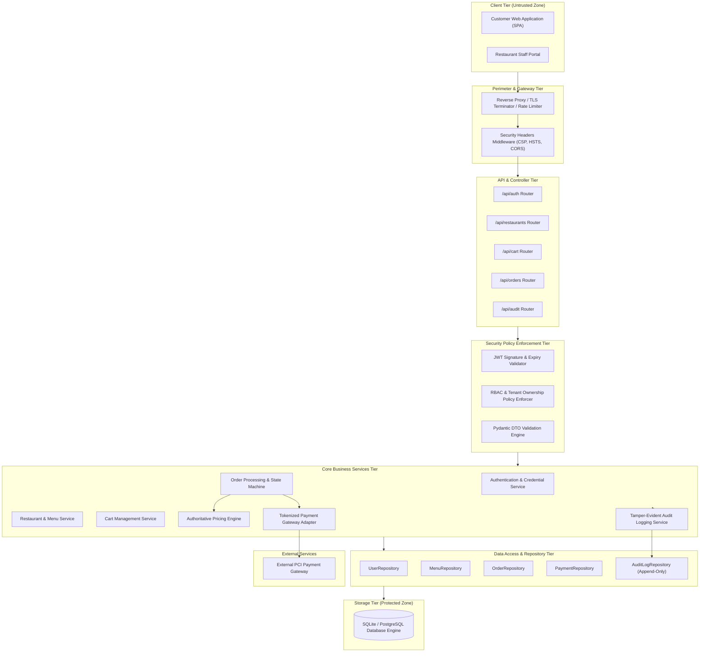

# Phase 5: Software & Security Architecture — QuickBite

## 1. System Architecture Diagram

QuickBite is designed following a **Secure Layered Architecture** with unidirectional top-down dependencies, enforced security boundaries, and decoupled domain services.

---

## 2. Component Responsibilities

| Component | Layer | Primary Responsibilities |
|---|---|---|
| **Reverse Proxy & Rate Limiter** | Perimeter | Terminates TLS 1.3, applies rate limits (e.g. 5 req/min on `/auth/login`), drops malformed packets. |
| **API Routers** | API Tier | Exposes REST endpoints, validates HTTP verbs, coordinates response serialization. |
| **Pydantic Validation Engine** | Interceptor | Enforces strict type schemas, regex constraints, minimum/maximum lengths, rejecting malicious payloads fail-closed before service execution. |
| **JWT & RBAC Enforcer** | Interceptor | Decodes Bearer JWT, validates cryptographic signature (HS256), extracts subject role (`customer`, `restaurant_staff`, `admin`), checks tenant ownership. |
| **AuthService** | Domain Service | Executes salted password hashing (bcrypt), validates credentials, issues signed JWTs with short time-to-live (TTL). |
| **Authoritative Pricing Engine** | Domain Service | Queries database for canonical item prices, computes item sums, tax calculations, and delivery charges. Discards client-supplied amounts. |
| **OrderService** | Domain Service | Manages order creation, verifies customer cart state, executes finite state machine transitions (`PLACED` $\to$ `ACCEPTED` $\to$ `DELIVERED`). |
| **PaymentService Adapter** | Domain Service | Interfaces with external payment provider using one-time tokens (`tok_...`), shielding core system from PCI compliance scope. |
| **AuditService** | Domain Service | Records immutable security events (logins, authorization failures, order creation, cancellations, price updates) with timestamp, actor, and IP. |
| **Repositories** | Data Access | Encapsulates SQL queries via SQLAlchemy ORM, isolating persistence logic from domain entities. |

---

## 3. System Interfaces & REST API Specification

| Endpoint | HTTP Method | Expected Role | Input DTO | Output DTO | Security Controls |
|---|---|---|---|---|---|
| `/api/auth/register` | `POST` | Public | `UserRegisterDTO` | `UserResponseDTO` | Password complexity check, bcrypt hashing ($\ge 12$ rounds). |
| `/api/auth/login` | `POST` | Public | `UserLoginDTO` | `TokenResponseDTO` | Rate-limited (5/min), constant-time hash comparison, audit log on failure. |
| `/api/restaurants` | `GET` | Public / Customer | Query params | `List[RestaurantDTO]` | Filters inactive vendors; no sensitive staff attributes exposed. |
| `/api/restaurants/{id}/menu` | `GET` | Public / Customer | `rest_id: int` | `List[FoodItemDTO]` | Read-only; excludes discontinued or hidden items. |
| `/api/restaurants/{id}/menu` | `POST` | `restaurant_staff` | `FoodItemCreateDTO` | `FoodItemDTO` | Verifies `staff.restaurant_id == id`; price $\ge 0.01$; audit log recorded. |
| `/api/cart` | `GET`, `POST` | `customer` | `CartUpdateDTO` | `CartResponseDTO` | Bound strictly to `current_user.id`; integer quantity limits ($1..99$). |
| `/api/orders` | `POST` | `customer` | `OrderCreateDTO` | `OrderResponseDTO` | **Authoritative pricing engine calculates total**; tokenized payment; audit log. |
| `/api/orders/{id}` | `GET` | `customer`, `staff` | `order_id: int` | `OrderDetailDTO` | **BOLA Ownership Check**: Customer can only view own order; staff only assigned restaurant. |
| `/api/orders/{id}/cancel` | `POST` | `customer` | None | `OrderResponseDTO` | Ownership check; State machine check (`status == PLACED` only). |
| `/api/orders/{id}/status` | `PATCH` | `restaurant_staff` | `StatusUpdateDTO` | `OrderResponseDTO` | Tenant ownership check; validates permitted FSM state transitions; audit log. |
| `/api/audit/logs` | `GET` | `admin` | Pagination params | `List[AuditLogDTO]` | Restricted to admin role; read-only access to immutable security ledger. |

---

## 4. Software Design Patterns & Concepts Applied

### 1. Layered Architecture (Separation of Concerns)
- Separates presentation, controller, domain logic, data access, and storage. Lower layers do not depend on upper layers, preventing leakages of HTTP-specific details into business calculation engines.

### 2. Repository Pattern
- Decouples business logic from persistence technology (SQLite in lab development, upgradable to PostgreSQL/RDS in production without touching service code).
- Isolates all database querying behind strongly-typed repository contracts.

### 3. Service Layer Pattern
- Encapsulates discrete business use cases (e.g., `OrderService`, `PricingEngine`). Centralizes domain logic, invariant enforcement, and state transitions in dedicated service classes rather than bloat inside API route controllers.

### 4. Data Transfer Object (DTO) Pattern
- Handled via Pydantic models. Distinguishes between internal database entities and public API shapes. Prevents Mass Assignment vulnerabilities by strictly ignoring unexpected fields in request bodies.

### 5. Role-Based & Attribute-Based Access Control (RBAC / ABAC)
- Enforces user capabilities by role (`customer`, `restaurant_staff`, `admin`) alongside attribute-based context checks (e.g., `order.customer_id == current_user.id` or `staff.restaurant_id == order.restaurant_id`).

### 6. Dependency Injection (DI)
- Utilizes FastAPI's `Depends()` framework to inject database sessions, current authenticated user objects, and service instances into route handlers, promoting testability with mock dependencies.

---

## 5. Security Component Mapping Matrix

| Security Function | Assigned Components | Enforcement Mechanism |
|---|---|---|
| **Authentication** | `AuthRouter`, `AuthService`, `UserRepository` | Salted bcrypt password verification, signed JWT issuance, rate limiting per IP. |
| **Order Processing & Integrity** | `OrderRouter`, `OrderService`, `PricingEngine`, `OrderRepository` | Authoritative database price extraction, Pydantic bounds checking, atomic transactions. |
| **Payment Protection** | `PaymentService`, `External Gateway Adapter` | Opaque token exchange (`tok_...`), zero persistence of PAN/CVV, transaction reference logging. |
| **Audit Logging** | `AuditService`, `AuditLogRepository`, Domain Events | Event hooks triggered on authentication, authorization failure, order lifecycle mutations. Append-only store. |
