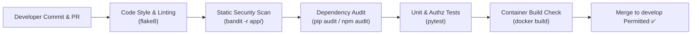

# Phase 11: Secure Build Environment & Version Control Governance — QuickBite

## 1. Secure Git Branching Strategy & Workflow

QuickBite enforces a strict **GitFlow with Security Gating** workflow to prevent unauthorized changes, credential leaks, and unreviewed code from entering production branches:

```
[feature/US-xx-name] ──> (Pull Request + CI Scans + Peer Review)
                                  │
                                  ▼
[develop] ─────────────────────────────────────────────────────────> (Integration Testing)
                                                                            │
                                                                            ▼
[main] ────────────────────────────────────────────────────────────> (Release Build + SAST)
```

### 1.1 Branch Topology & Purpose
1. **`main` Branch (Production Protected)**:
   - Houses production-ready code. Direct pushes are blocked (`push --force` disabled).
   - Only receives code through approved Pull Requests originating from `develop` after release verification.
   - Every merge to `main` creates an immutable cryptographic Git tag.
2. **`develop` Branch (Integration Protected)**:
   - Aggregates completed features for sprint integration and end-to-end regression testing.
   - Protected branch requiring passing status checks before merge.
3. **`feature/US-xx-<description>` Branches**:
   - Short-lived branches branched off `develop` for individual user stories.
   - Developers work in isolated branches and submit Pull Requests back to `develop`.

---

## 2. Five Core Secure Build & Source Code Controls

### Control 1: Branch Protection Rules & Mandatory Peer Review
- Enforce GitHub branch protection on `main` and `develop`:
  - **Require at least 1 approving review** from a senior engineer before merging.
  - **Require status checks to pass before merging** (unit tests, security scans, linting).
  - **Require linear history** (rebase or squash merges) to maintain an auditable commit log.
  - **Restrict who can push**: Admin access required to alter branch protection rules.

### Control 2: Zero Secret Storage & Secret Scanning
- Absolute ban on storing credentials, JWT secret keys, database passwords, or payment tokens in Git.
- Repository includes `.gitignore` preventing accidental commits of `.env`, `*.db`, `*.pem`, `*.key`, and virtual environments.
- Template `.env.example` contains non-sensitive placeholders only (`JWT_SECRET=change_this_to_a_secure_256bit_random_key_in_production`).
- Automated pre-commit hooks and GitHub Actions secret scanners (Trufflehog / GitGuardian) scan every commit diff for high-entropy strings and known API key patterns.

### Control 3: Automated Dependency Vulnerability Auditing (Software Composition Analysis - SCA)
- Dependencies are pinned to specific versions in `requirements.txt` and `package.json` to guarantee reproducible builds.
- Automated CI pipeline runs `pip audit` / `safety` and `npm audit` on every Pull Request.
- Builds fail automatically if dependencies contain known CVEs with High or Critical CVSS scores ($\ge 7.0$).

### Control 4: Static Application Security Testing (SAST) Gating
- Automated static security analysis configured in GitHub Actions using `bandit` (Python security linter) and `flake8`.
- Scans enforce secure coding practices: flags use of `eval()`, weak hashing algorithms (`md5`, `sha1`), hardcoded credentials, and unsafe subprocess execution.

### Control 5: Least Privilege Access & Signed Commits
- Developers are assigned granular repository roles (Write access on feature branches; Admin rights restricted to Tech Lead/Security Officer).
- Developers sign all Git commits with GPG/SSH keys to prove provenance and prevent commit author spoofing.

---

## 3. Configuration & Environment Security

### 3.1 Repository `.gitignore` Specification
The `.gitignore` file at the repository root strictly ignores:
- Python bytecode and caches (`__pycache__/`, `*.pyc`, `.pytest_cache/`)
- Virtual environments (`.venv/`, `env/`)
- SQLite databases and local data stores (`*.db`, `*.sqlite3`, `quickbite.db`)
- Environment variable and secret files (`.env`, `.env.local`, `*.pem`, `*.key`)
- Local IDE configurations and operating system artifacts (`.vscode/`, `.idea/`, `.DS_Store`, `Thumbs.db`)
- Application runtime logs (`*.log`, `logs/`)

### 3.2 Environment Template (`.env.example`)
The template provides documentation for required environment keys while ensuring no secrets are exposed:
```bash
# Server Configuration
ENVIRONMENT=development
PORT=8000
DEBUG=False

# Cryptographic Authentication Secrets
# In production, generate using: openssl rand -hex 32
JWT_SECRET=quickbite_super_secret_jwt_signing_key_for_development_only_replace_me
JWT_ALGORITHM=HS256
ACCESS_TOKEN_EXPIRE_MINUTES=60

# Database Configuration
DATABASE_URL=sqlite:///./quickbite.db

# Payment Gateway Adapter Configuration (Sandbox)
PAYMENT_GATEWAY_URL=https://api.mockgateway.local/v1
PAYMENT_API_KEY=test_key_sample_placeholder_not_a_real_secret
```

---

## 4. Automated CI/CD Security Check Architecture



If any scanner detects a high-severity flaw or test regression, the CI pipeline terminates with a non-zero exit code, blocking the Pull Request automatically.
