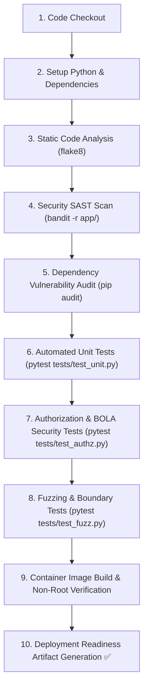

# Phase 14: Security Testing & CI/CD Pipeline Automation — QuickBite

## 1. Automated CI/CD Pipeline Architecture

The automated security and testing pipeline is defined in `.github/workflows/ci.yml`. It runs automatically on every Pull Request and merge to `main` and `develop`.



---

## 2. Security Test Suites & Coverage Focus

### 2.1 Suite 1: Authentication & Token Security Tests
- Verifies registration with strong passwords.
- Validates bcrypt hashing with salt.
- Tests login with valid credentials (returns signed JWT with correct claims).
- Verifies rejection of invalid passwords (returns HTTP 401 without user enumeration).
- Tests expired or tampered JWT signatures (returns HTTP 401 Unauthorized).

### 2.2 Suite 2: Authoritative Order Pricing & Integrity Tests
- Tests standard checkout and ensures accurate computation of line items, tax (10%), and delivery fee ($3.00).
- **Price Manipulation Test**: Submits request with intentionally crafted lower prices; verifies that the server ignores client prices and charges authoritative database sums.
- Verifies that disabled or out-of-stock items cannot be ordered.

### 2.3 Suite 3: Authorization, Tenant Isolation & BOLA (IDOR) Tests
- **Customer Ownership Test**: Authenticates User A, creates Order A. Authenticates User B and attempts `GET /api/orders/{OrderA_id}` and `POST /api/orders/{OrderA_id}/cancel`. Verifies HTTP 403 Forbidden is raised and audit log records the incident.
- **Restaurant Staff Tenant Test**: Authenticates Staff of Restaurant 1 and attempts to update or view orders belonging to Restaurant 2. Verifies HTTP 403 Forbidden.
- **State Machine Transition Test**: Tests cancelling an order after its status has transitioned to `ACCEPTED` or `PREPARING`. Verifies rejection with HTTP 400 Bad Request.

### 2.4 Suite 4: Input Boundary & Fuzzing Tests
The fuzzing harness tests resilience against invalid, boundary, and hostile inputs:
- **Quantity Boundary**: Quantities of $0$, $-1$, $-999999$, and $100000$ (must return HTTP 422 Unprocessable Entity).
- **Payload String Injections**: Dish names and delivery addresses containing SQL injection vectors (`' OR '1'='1`) and XSS script tags (`<script>alert(1)</script>`).
- **Malformed Identifiers**: Negative IDs (`-1`), non-existent IDs (`999999`), and non-numeric strings (`"abc"`).
- **Empty Payloads**: Empty item arrays, missing delivery addresses, and malformed tokens.

---

## 3. Standard Defect Report Template

When defects or security findings are identified during manual or automated test execution, they are logged using the following standard template:

| Field | Defect Log Entry Template |
|---|---|
| **Defect ID** | `DEF-SEC-<NUMBER>` (e.g., `DEF-SEC-01`) |
| **Defect Title** | Concise summary of the issue (e.g., *BOLA in Order Cancellation Endpoint Allows Cross-User Order Cancellation*) |
| **Severity** | **Critical** / **High** / **Medium** / **Low** |
| **Component** | Subsystem affected (e.g., `OrderService / OrderRouter`) |
| **Environment** | Test environment, Python version, OS |
| **Steps to Reproduce** | 1. Authenticate as Customer 1 and create Order ID 10.<br>2. Authenticate as Customer 2.<br>3. Send `POST /api/orders/10/cancel` using Customer 2's bearer token.<br>4. Observe response. |
| **Expected Behavior** | Server returns HTTP 403 Forbidden; order status remains unchanged; audit log records security alert. |
| **Actual Behavior** | Server returns HTTP 200 OK and changes Order 10 status to `CANCELLED`. |
| **Root Cause** | Endpoint omitted the ownership check `order.customer_id == current_user.id`. |
| **Fix Description** | Added authorization check in `OrderService.cancel_order()` verifying that the requesting user's ID matches the order owner before status mutation. |
| **Retest Status** | **Pass / Fail** (Verified via automated test `test_unauthorized_user_cannot_cancel_order`). |

---

## 4. Test Execution Instructions
*(Note: To run the automated security and boundary tests on the QuickBite codebase, execute the following command in the test environment):*
```bash
pytest tests/ -v
```
All tests run against a fast, in-memory SQLite database instance with clean isolation per test function.
